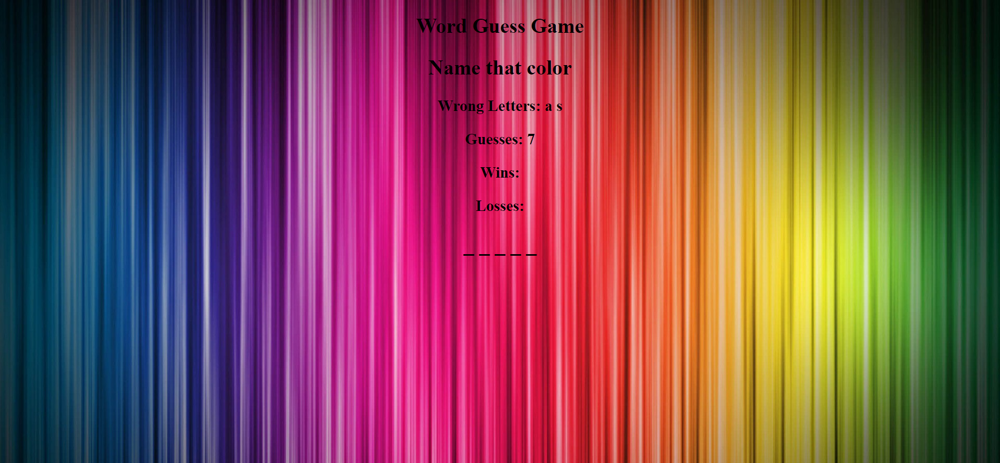
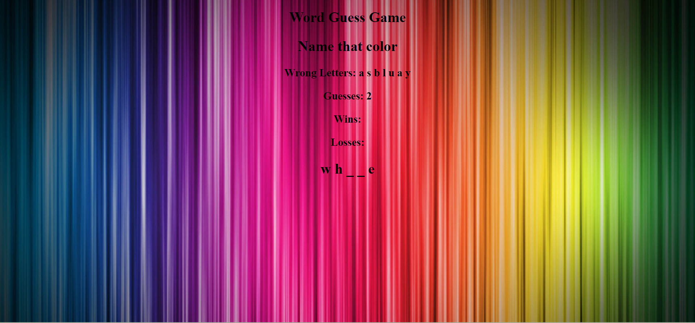
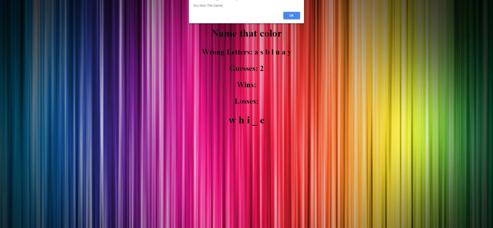

# Word-Guess

* This is a word guessing game

* There will be a randomly chosen word for a array that i have made.

* I will display like this  '_ _ _ _ _ _'.

* The user will try to guess the correct letters in the word.

* There is a set number of guess that the user has before they lose.

* It will display the leters that the user has already guessed.

* After the user wins or losses the game will automatically chose a new word. 

